# SkyWise – Aviation Intelligence Dashboard

## Overview
SkyWise is an aviation analytics project that explores how weather conditions and airport operations affect flight delays.

It is designed as a simulation of a real-world aviation intelligence system that could support pilots, airlines, and aviation analysts.

This project reflects my interest in aviation and my goal of becoming a commercial pilot, combined with my interest in data science and technology.

---

## Objective
The goal of SkyWise is to understand how data-driven systems can help improve aviation decision-making by analyzing:

- Weather conditions
- Airport congestion
- Flight routes
- Delay patterns

---

## Features

### 1. Flight Delay Predictor
- Select departure and arrival airports
- Choose date and weather conditions
- Outputs delay risk:
  - Low Risk
  - Medium Risk
  - High Risk
- Shows contributing factors

---

### 2. Aviation Weather Center
Displays aviation-relevant weather data:
- Wind speed
- Visibility
- Temperature
- Cloud cover
- Rain probability
- Pilot-friendly summary

---

### 3. Airport Analytics
- Compare airports
- View delay trends
- Analyze traffic patterns
- Visual charts

---

### 4. Data Visualization
- Line charts for delay trends
- Bar charts for airport comparison
- Risk distribution graphs

---

### 5. Learning Section
Explains:
- How weather affects aviation
- Why flights get delayed
- Basics of flight planning
- Aviation safety concepts

---

## Supported Airports
- Jeddah (JED)
- Singapore (SIN)
- Dubai (DXB)
- London (LHR)
- Doha (DOH)
- New York (JFK)
- Mumbai (BOM)

Example routes:
- JED → DXB
- SIN → LHR
- DXB → JFK
- BOM → SIN
- DOH → LHR

---

## Concept Idea
SkyWise uses simplified logic based on:

- Weather severity
- Airport congestion
- Route distance
- Historical delay trends

This simulates how real aviation analytics systems help predict delays.

---

## Design
- Aviation-inspired UI
- Navy blue, sky blue, white theme
- Dashboard-style layout
- Clean and professional interface

---

## Future Improvements
- Machine learning-based prediction model
- Real-time flight data integration
- Live weather APIs
- Mobile app version
- Advanced aviation analytics

---

## Motivation
I have a strong interest in aviation and aspire to become a commercial pilot in the future.

This project combines my passion for flying with my interest in data science and technology, helping me understand how modern aviation systems work behind the scenes.
## Motivation
I have a strong interest in aviation and aspire to become a commercial pilot in the future.

This project combines my passion for flying with my interest in data science and technology.

---

## Screenshots

### Dashboard (Overview)
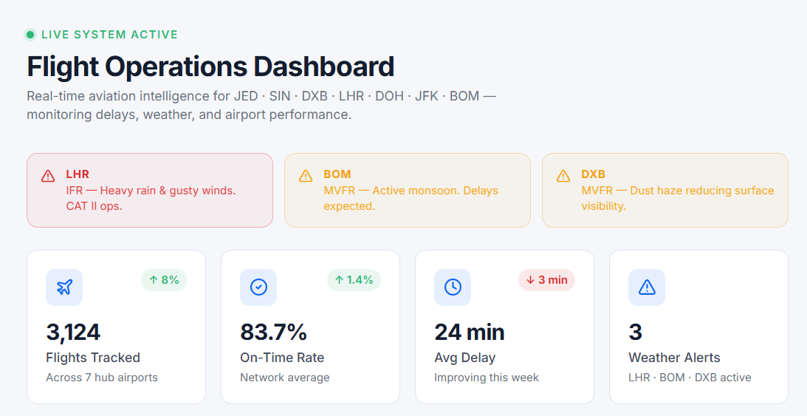
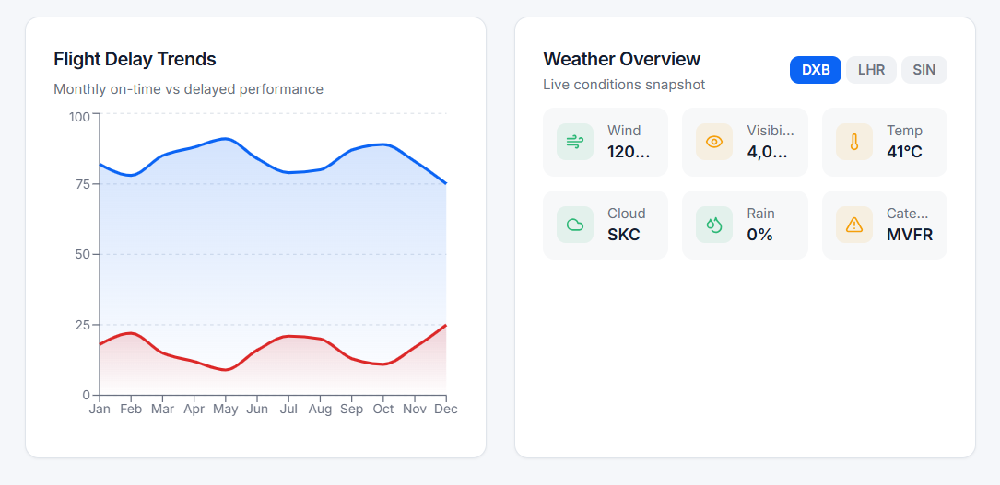
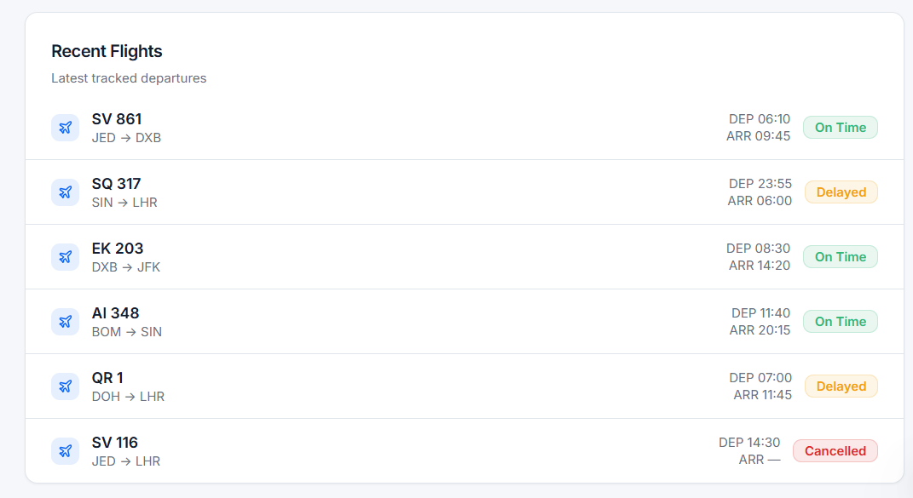

### Delay Predictor
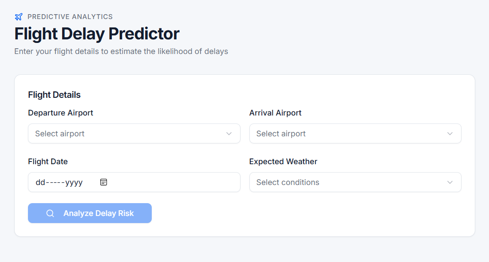

### Weather Center
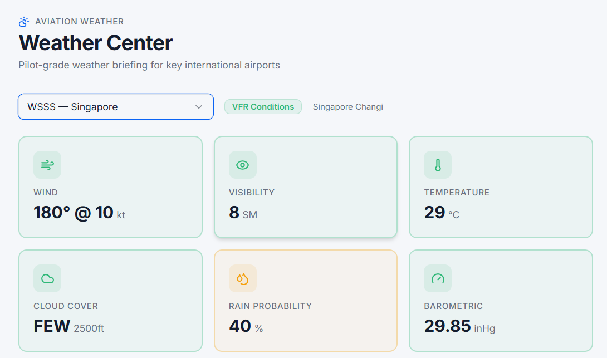
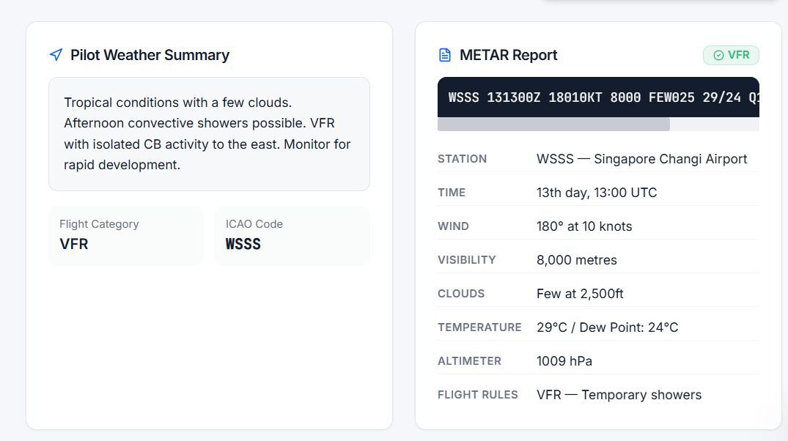

### Airport Analytics
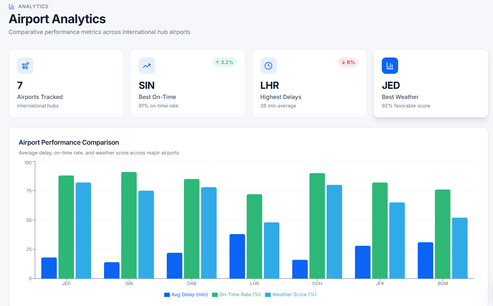
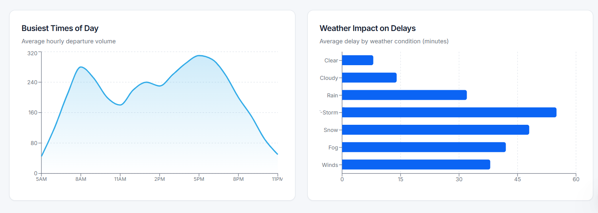

### Pilot Academy
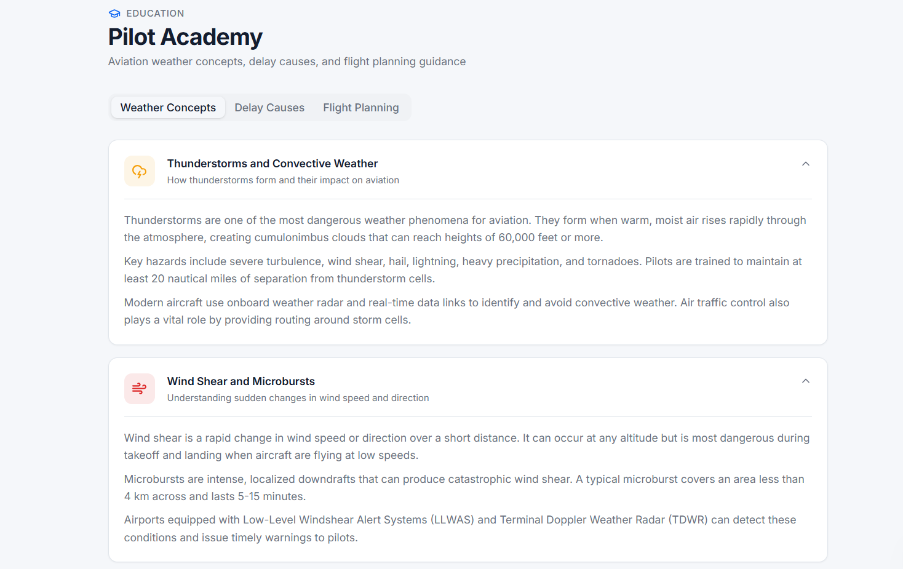
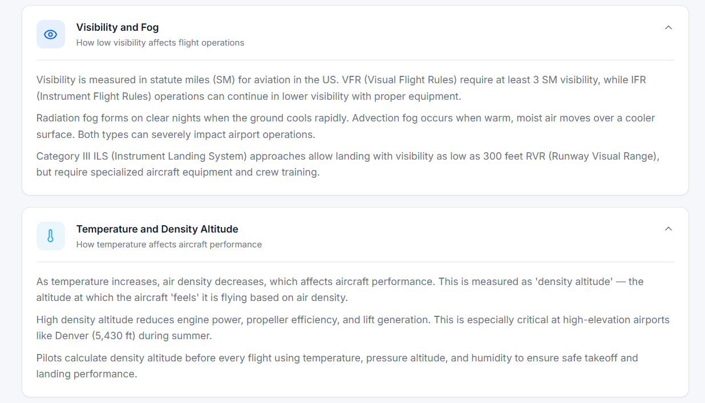
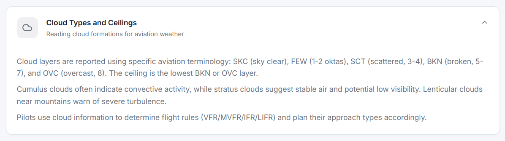
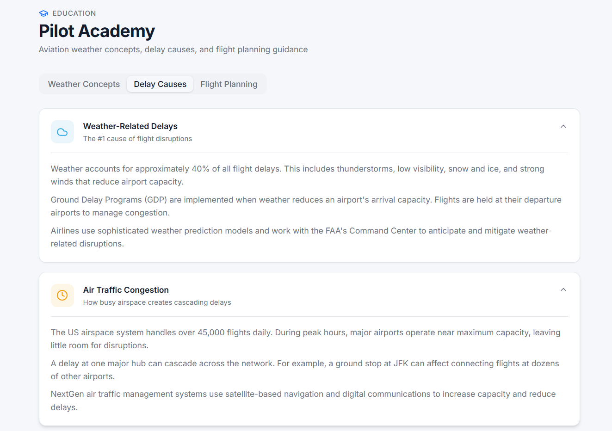
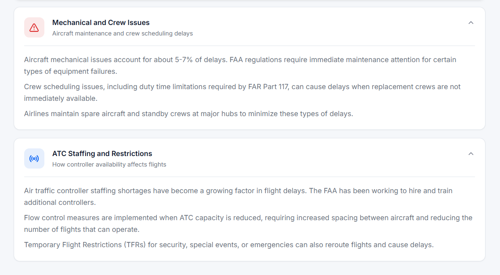
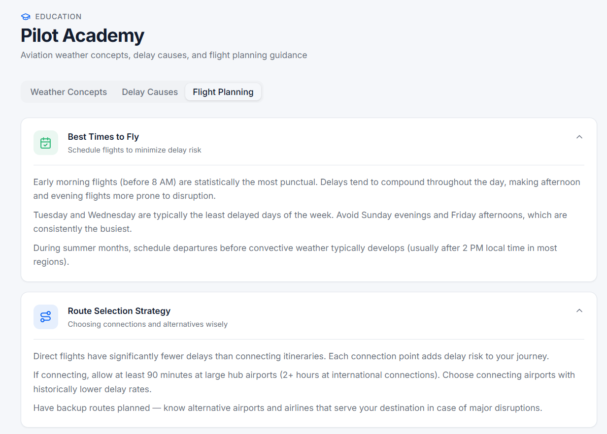
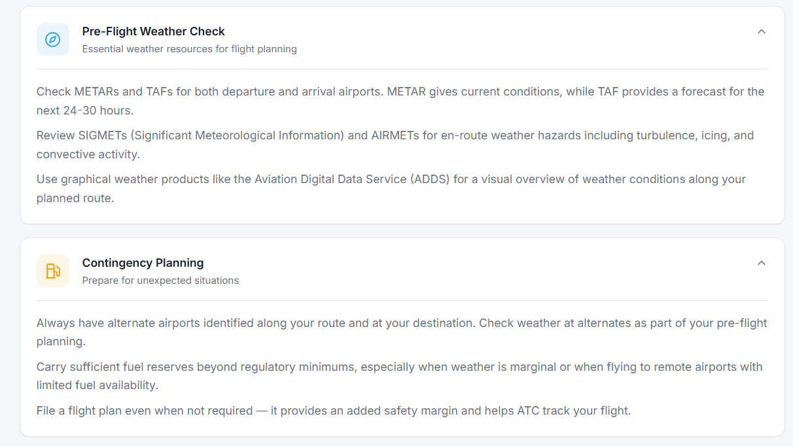

### About project
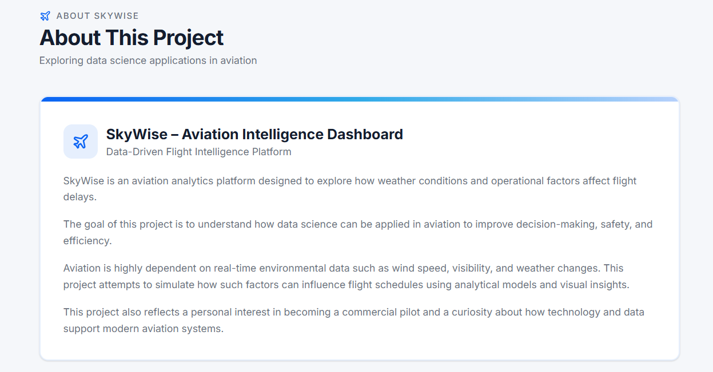
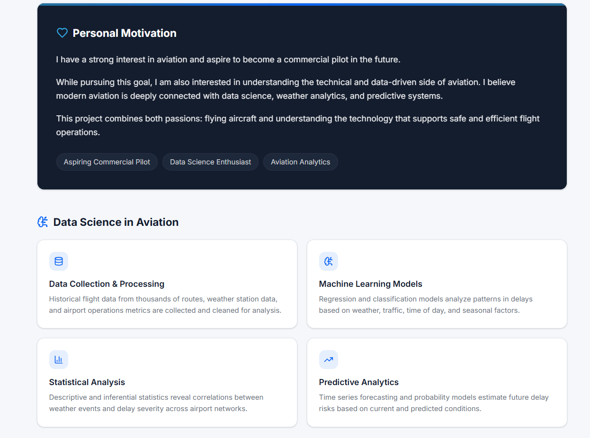
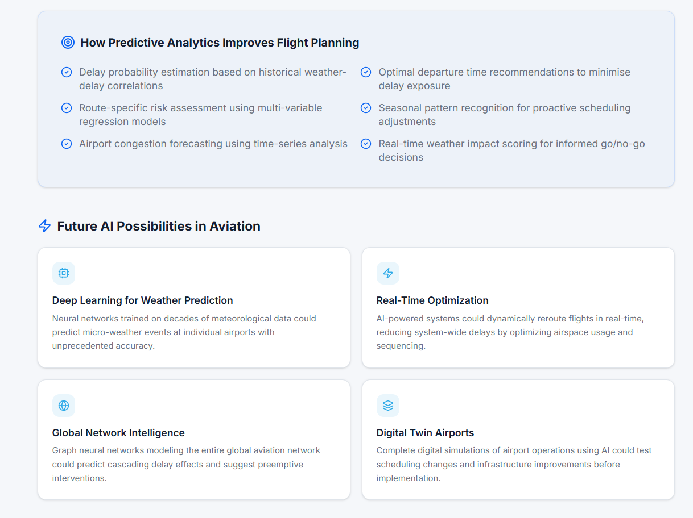

### Tech Used
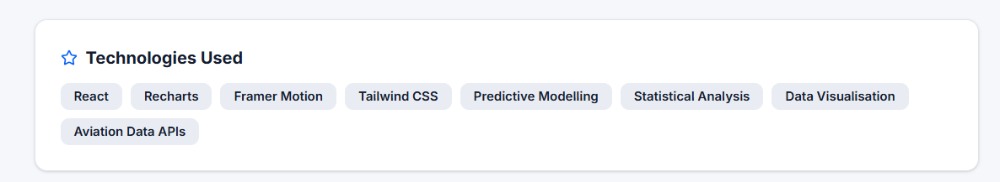

---

## Note
This is a conceptual project created for learning and university portfolio purposes (NUS/NTU level applications).
